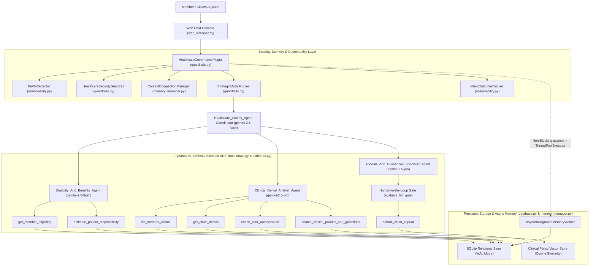

# Healthcare Claims Multi-Agent System — Deep-Dive Code Walkthrough Across the 5 Evaluation Parameters

This document provides an end-to-end code walkthrough of the **Healthcare Claims Multi-Agent System** (`arnbisgcp/CALEVAL`, deployed on **Vertex AI Agent Engine** as `reasoningEngines/6960836041880109056` in project `arnbtest`), mapped directly to the **5 evaluation parameters**.

---

## High-Level System Architecture

---

## Parameter 1: Tool & Interface Design (`schemas.py` & `main.py`)

### 1. Strict Enumerations & Input Validation Schemas
In `schemas.py`, every tool has a dedicated request `BaseModel` configured with `ConfigDict(extra="forbid", str_strip_whitespace=True)`, regex pattern validation, numeric bounds, and `@field_validator` normalizers:
- `PlanStatus`, `ClaimStatus`, `ClaimStatusFilter`, `NetworkStatus`, `PriorAuthStatus`, and `AppealStatus` constrain categorical fields to valid domain states.
- `ListClaimsRequest` enforces `pattern=r"^MEM-\d{4}$"` on `member_id` and normalizes `status_filter` to `ClaimStatusFilter`.
- `CostEstimateRequest` enforces `pattern=r"^\d{4,5}[A-Z]?$"` on `cpt_code` and `gt=0.0, le=1_000_000.0` on `estimated_allowed_amount`.
- `SubmitAppealRequest` enforces `pattern=r"^CLM-\d{4}-\d{4}$"`, `min_length=10, max_length=2000` on `appeal_reason`, and includes `human_confirmed: bool`.

### 2. Constrained Output Envelopes & Guided Error Recovery
Every tool in `main.py` declares an explicit Pydantic return type annotation (`-> MemberEligibilityResponse`, `-> MemberClaimsListResponse`, `-> ClaimDetailsResponse`, `-> PriorAuthLookupResponse`, `-> CostEstimateResponse`, `-> ClaimAppealResponse`, `-> PolicySearchResponse`) and returns actionable recovery hints (`available_member_ids`, `available_claim_ids`, or `hitl_prompt`) when validation or lookup fails.

---

## Parameter 2: Context & Memory Management (`database.py` & `memory_manager.py`)

### 1. Persistent Relational SQLite Store & Clinical Policy Vector Store
`ClaimsDatabaseAndVectorRepository` (`database.py`) initializes a persistent SQLite database in Write-Ahead Logging (`PRAGMA journal_mode=WAL;`) mode with 6 normalized tables:
1. `members` — Indexed by `member_id` and `full_name`.
2. `claims` — Indexed by `claim_id`, `member_id`, and `status`.
3. `prior_authorizations` — Indexed by `pa_id` and `member_id`.
4. `claim_appeals` — Persists submitted appeals (`save_appeal`).
5. `clinical_policy_vectors` — Stores clinical coverage policies (`POL-CARC-197`, `POL-LCD-L33965`, `POL-CARC-50-GENOMICS`, `POL-LCD-L34636`) with L2-normalized sparse/bigram vector embeddings (`compute_sparse_embedding`) and retrieves them via `cosine_similarity` in `search_policy_vectors`.
6. `long_term_memories` — Stores cross-session semantic interaction facts with vector embeddings (`insert_long_term_memory` and `search_long_term_memories`).

### 2. Context Bloat Management & Sliding-Window Compaction
In `main.py` and `memory_manager.py`:
- Registers ADK's `ContextFilterPlugin(num_invocations_to_keep=6)` on `AdkApp`.
- `ContextCompactionManager.compact_llm_request` truncates oversized parts exceeding `MAX_PART_TEXT_CHARS = 2400` and compacts older conversation turns when `len(contents) > 8` or `estimated_tokens > 6000`, storing a structured summary of referenced `MEM-xxxx`, `CLM-xxxx-xxxx`, and `PA-xxxx-xxx` entities in `callback_context.state["compacted_session_memory"]`.

### 3. Asynchronous Background Memory Consolidation
`AsyncBackgroundMemoryWorker.schedule_background_consolidation` (`memory_manager.py`) uses `asyncio.create_task` and a background `ThreadPoolExecutor(max_workers=2)` to asynchronously extract and persist long-term clinical interaction facts after each turn without blocking the main agent response.

---

## Parameter 3: Orchestration & Logic (`main.py` & `guardrails.py`)

### 1. Multi-Agent Hierarchy & Strategic Model Routing
- `Healthcare_Claims_Agent` (`gemini-2.5-flash`) coordinates 3 specialized sub-agents:
  1. `Eligibility_And_Benefits_Agent` (`gemini-2.5-flash`) — Low-latency member eligibility and out-of-pocket cost estimation.
  2. `Clinical_Denial_Analyst_Agent` (`gemini-2.5-pro`) — High-reasoning CPT/ICD-10 medical necessity and CARC/RARC denial root-cause analysis + clinical policy vector search.
  3. `Appeals_And_Grievances_Specialist_Agent` (`gemini-2.5-pro`) — Regulated adjudication specialist for formal claim appeals.
- `StrategicModelRouter.select_model` (`guardrails.py`) dynamically routes between `gemini-2.5-flash` and `gemini-2.5-pro` based on intent complexity.

### 2. Security Guardrails & Human-in-the-Loop (HITL) Confirmation Hooks
- `HealthcareSecurityGuardrail.inspect_user_prompt` (`guardrails.py`) blocks prompt injection, system prompt extraction, SQL injection, and bulk PHI exfiltration in `before_model_callback`.
- `requires_appeal_hitl_confirmation` and `evaluate_hitl_gate` enforce Human-in-the-Loop approval on `submit_claim_appeal` for high-dollar claims (`>= $1,000`).

---

## Parameter 4: Observability & Tracing (`observability.py`)

1. **HIPAA PII/PHI Redaction (`PiiPhiRedactor`):** Scrubs SSNs (`[REDACTED-SSN]`), payment cards, phone numbers, emails, Medicare MBIs, and masks DOBs (`1985-**-** [REDACTED-DOB]`) across prompts, model outputs, and logs.
2. **Cloud Logging Structured JSON Formatter (`StructuredJsonFormatter`):** Emits single-line JSON log records correlated with OpenTelemetry `logging.googleapis.com/trace` and `logging.googleapis.com/spanId`.
3. **Intent vs. Outcome Auditing (`IntentOutcomeTracker`):** Classifies user intent at turn start, tracks invoked tools and errors, sets OpenTelemetry span attributes (`gen_ai.intent.categories`, `gen_ai.outcome.status`, `gen_ai.outcome.goal_alignment_score`), and emits a structured `INTENT_VS_OUTCOME_AUDIT` event.

---

## Parameter 5: Infrastructure & CI/CD (`terraform/`, `secrets_manager.py`, `evals/`, `cloudbuild.yaml`)

1. **Automated Golden Dataset Evaluation Suite (`evals/golden_dataset.json` & `evals/run_evaluation.py`):** Evaluates 8 benchmark scenarios (`GOLD-001` through `GOLD-008`) across intent classification, model routing, Pydantic schema compliance, and domain assertions (`100%` pass rate).
2. **Terraform IaC (`terraform/`):** Provisions Google Cloud APIs, least-privilege Service Account & IAM bindings, Secret Manager secrets (`gcp-project-id`, `reasoning-engine-id`), and versioned GCS staging storage.
3. **Google Cloud Secret Manager & ADC (`secrets_manager.py`):** Retrieves secrets via `SecretManagerServiceClient` with TTL caching and authenticates via Application Default Credentials (`google.auth.default()`).
4. **CI/CD Pipelines (`cloudbuild.yaml` & `ci_cd_workflow.yml`):** Automates unit tests, Golden Dataset Evaluation Gate (`--min-score 0.95`), Terraform validation, and Vertex AI Agent Engine deployment.
